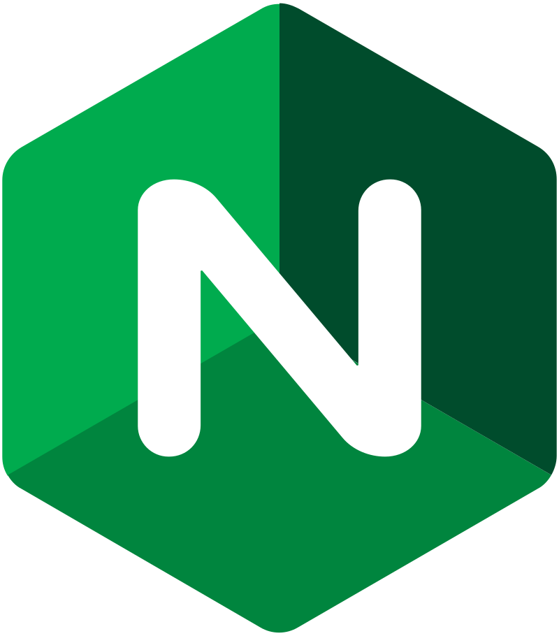

# Hi there 👋

I'm **Didier Crespo**, a person who always likes to learn new things, I am passionate about mobile development and I love that everything works perfectly.
I love to extend my knowledge to those who need it, and that is why I am a member and also the president of this same student chapter called **[AAAIMX International Student Chapter](https://aaaimx.org/)**.

## Stats

||  | 
| -------------------------------------------------------------------------- | ---------------------------------------------------------------------------- |
</nobr>

## Skills

### Frameworks FrontEnd :package:

| |  |  |
| -------------------------------------------------------------------------- | ---------------------------------------------------------------------------- | -------------------------------------------------------------------------- |

### Frameworks BackEnd :package:

|  |  | 

### Programming Languages :computer:

|  |  |  |  | 

### Tools SRE  :hammer_and_wrench:

|  |  |  |

### Databases :floppy_disk:

|  |  |  |

### other technologies :hammer_and_wrench:

 

### Cloud :cloud:

|  |  |  |

<h3>Connect with me</h3>

     

### :hugs: Thank You!

Thank you so much for visiting my tiny space on [GitHub](https://github.com/djcrespo)! :v:
